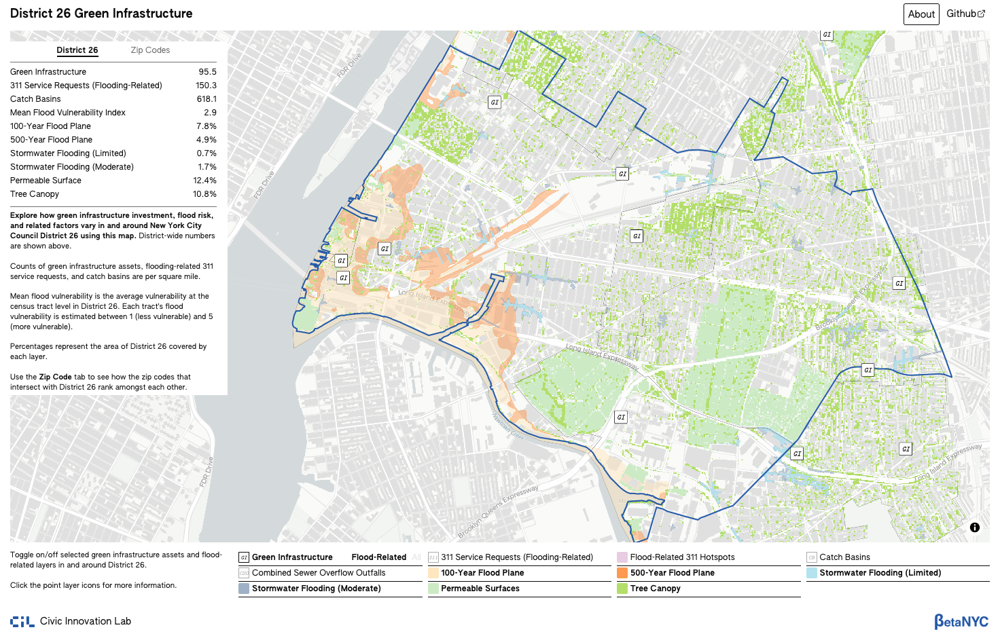

# District 26 Green Infrastructure Web Map


**Where in New York City Council District 26 are areas of high flood risk with low green infrastructure investment?** 

The Office of Council Member Julie Won asked the Civic Innovation Lab at BetaNYC to develop an interactive web map to explore flooding, green infrastructure, investment, and related data in and around Council District 26. The Lab used this opportunity to set a new bar for our web mapping work by establishing end-to-end reproducibility making use of open-source tooling, CI/CD, and thorough documentation. 

By default, the web map displays areas of flood risk (both coastal and stormwater) and flood-mitigation and the boundary of Council District 26. These mitigating features include flood-related green infrastructure and areas of permeable surfaces and of tree canopy. Additionally, users may view the locations of flood-related 311 service requests during Council Member Won’s tenure (since January 1, 2022), hotspots of flood-related 311 service requests, catch basins, and combined sewer overflow outfalls.

In the map’s sidebar, users may switch between views of District 26 and its overlapping zip codes. In the District 26 view, district wide counts (per square mile) and amounts (percentage of district area) of flood-related factors are displayed. Selecting a single zip code in the sidebar displays a ranking of these same factors against the other intersecting zip codes, enabling comparison.

## Architecture
This repository features an analytical pipeline and a companion front end web application. The pipeline is written in `R` using the `{targets}` framework, executed inside Docker. Wherever possible, live data are fetched regularly from City and Federal APIs. Data from sources that cannot easily be accessed programmatically are mirrored to Github Released in order to be consumed in the pipeline. The pipeline outputs feature attributes in Parquet, PMTiles vector tiles, and Cloud-Optimized GeoTiffs.

These data are visualized by the Svelte + MabLibre GL JS front end in /web, which is based on BetaNYC’s Boundaries Map

## Documentation
See [METHODOLOGY.md]() for full documentation of the `{targets}` pipeline. [DATA_SOURCES.md]() details this project’s data sources and the intermediate products mirrored via Github Releases. Front-end documentation can be found in [web/README.md](). 

## Repo Structure
```text
d26-gi-web-map/
├── _targets.R                             # the {targets} pipeline definition
├── R/                                     # function library for the pipeline
├── scripts/                               # standalone scripts for github release data mirror 
│   ├── 0N_mirror_*.R                      # static data processing scripts
│   ├── 06_process_zonal_stats.R           # raster zonal stats (from 100+GB land cover raster)
│   └── refresh_311.R                      # daily 311 fetch, used in both pipeline and 0N_*.R
├── data/
│   ├── prepared/           	           # 311 GeoJSON (committed)
│   └── processed/                         # pipeline outputs: PMTiles, COG, Parquet
├── web/                                   # Svelte 5 + MapLibre frontend
|   ├── README.md                          # front end documentation
│   ├── src/
│   │   ├── components/                    # UI (sidebar, modals, primitives, icons)
│   │   └── lib/                           # layer registry, map, stores
│   │       └── map/
│   ├── public/
│   │   ├── data -> ../../data/processed   # symlink for local development
│   │   └── fonts/
│   └── package.json
├── .github/workflows/
│   ├── build-image.yml					   # build image on update → ghcr.io
|	├──	pipeline.yml                       # run pipeline → build web → deploy
│   └── refresh-311.yml                    # daily 311 cron
├── Dockerfile							   
├── METHODOLOGY.md						   # methodology
├── DATA_SOURCES.md						   # data citations
└── README.md
```

## Credits
This project was developed by the Civic Innovation Lab at BetaNYC for the Office of Council Member Julie Won. It makes use of open data from New York City Open Data, the New York City Department of City Planning, the Federal Emergency Management Agency, Esri, and the NYC Open Sewer Project. Complete citation of data sources can be found in [DATA_SOURCES.MD]().

Anthropic’s Opus 4.8 model was used via Claude Code to develop the front end web application. The user interface was first designed using Figma by hand, then the Figma MCP server was connected to Claude Code to produce the Svelte app.

This project has been released under an MIT License. 

